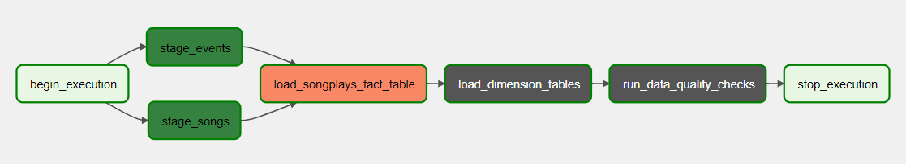

# Data Pipelines with Apache Airflow
This is the fifth project from Nanodegree Data Engineering from Udacity. The projects aims to create a data pipeline using Apache Airflow that loads data from S3 to Redshift, creates dimension and fact tables in DataWarehouse and check the Data Quality created tables.

## Udacity
### Introduction
A music streaming company, Sparkify, has decided that it is time to introduce more automation and monitoring to their data warehouse ETL pipelines and come to the conclusion that the best tool to achieve this is Apache Airflow.

They have decided to bring you into the project and expect you to create high grade data pipelines that are dynamic and built from reusable tasks, can be monitored, and allow easy backfills. They have also noted that the data quality plays a big part when analyses are executed on top the data warehouse and want to run tests against their datasets after the ETL steps have been executed to catch any discrepancies in the datasets.

The source data resides in S3 and needs to be processed in Sparkify's data warehouse in Amazon Redshift. The source datasets consist of JSON logs that tell about user activity in the application and JSON metadata about the songs the users listen to.

### Overview
This project will introduce you to the core concepts of Apache Airflow. To complete the project, you will need to create your own custom operators to perform tasks such as staging the data, filling the data warehouse, and running checks on the data as the final step.

We have provided you with a project template that takes care of all the imports and provides four empty operators that need to be implemented into functional pieces of a data pipeline. The template also contains a set of tasks that need to be linked to achieve a coherent and sensible data flow within the pipeline.

You'll be provided with a helpers class that contains all the SQL transformations. Thus, you won't need to write the ETL yourselves, but you'll need to execute it with your custom operators.

### Operators
#### Stage Operator
The stage operator is expected to be able to load any JSON formatted files from S3 to Amazon Redshift. The operator creates and runs a SQL COPY statement based on the parameters provided. The operator's parameters should specify where in S3 the file is loaded and what is the target table.

The parameters should be used to distinguish between JSON file. Another important requirement of the stage operator is containing a templated field that allows it to load timestamped files from S3 based on the execution time and run backfills.

#### Fact and Dimension Operators
With dimension and fact operators, you can utilize the provided SQL helper class to run data transformations. Most of the logic is within the SQL transformations and the operator is expected to take as input a SQL statement and target database on which to run the query against. You can also define a target table that will contain the results of the transformation.

Dimension loads are often done with the truncate-insert pattern where the target table is emptied before the load. Thus, you could also have a parameter that allows switching between insert modes when loading dimensions. Fact tables are usually so massive that they should only allow append type functionality.

#### Data Quality Operator
The final operator to create is the data quality operator, which is used to run checks on the data itself. The operator's main functionality is to receive one or more SQL based test cases along with the expected results and execute the tests. For each the test, the test result and expected result needs to be checked and if there is no match, the operator should raise an exception and the task should retry and fail eventually.

For example one test could be a SQL statement that checks if certain column contains NULL values by counting all the rows that have NULL in the column. We do not want to have any NULLs so expected result would be 0 and the test would compare the SQL statement's outcome to the expected result.

## Data
The data we use is available in two differents folders in S3 bucket : `s3://udacity-dend/log-data` for log data and `s3://udacity-dend/song-data` for song data.

## About the tables
### Staging Tables
**staging_events** - It contains all data from `JSON` files located in `s3://udacity-dend/log-data` loaded into a Redshift table.
**staging_songs** - It contains all data from `JSON` files located in `s3://udacity-dend/song-data` loaded into a Redshift table.

### Fact Table
**songplays** - records in event data associated with song plays i.e. records with page NextSong:
- songplay_id, start_time, year, month, user_id, level, song_id, artist_id, session_id, location, user_agent
### Dimension Tables
**users** - users in the app:
- user_id, first_name, last_name, gender, level  

**songs** - songs in music database:
- song_id, title, artist_id, year, duration  

**artists** - artists in music database:
- artist_id, name, location, latitude, longitude  

**time** - timestamps of records in songplays broken down into specific units:
- start_time, hour, day, week, month, year, weekday  

## How to run the project?
### Installing Airflow in Docker
On this project we have used [Apache Airflow(`2.1.3`) with Docker](https://airflow.apache.org/docs/apache-airflow/stable/start/docker.html). In [this](https://airflow.apache.org/docs/apache-airflow/stable/start/docker.html) link you can find all the detailed steps to install and run in your local machine.

To start just run the following commands (if you have Docker installed) and you will be ready to run.
``` console
$ mkdir ./dags ./logs ./plugins
$ echo -e "AIRFLOW_UID=$(id -u)\nAIRFLOW_GID=0" > .env
$ docker-compose up airflow-init
$ docker-compose up
```

### Airflow UI
Access the http://localhost:8080/ in your machine and you will be able to see the Airflow UI and navigate through the created DAG for this project, called `etl_pipeline_sparkify`.

